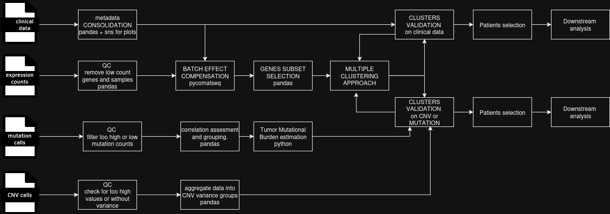

## PIPELINE REVIEW AND IMPROVEMENT PROPOSAL
### ASSESMENT OF THE CURRENT PIPELINE
#### BRIEF PIPELINE DESCRIPTION
This pipeline combines bulk (aggregated from multiple cells and cell-types) transcriptomic data with clinical data from patients to possibly:
1. discover specific genes (or subsets of them) associated with specific subgroups of sample donors(donor stratification into biology-driven groups);
2. discover new biomarkers associated with clinical data (tumor stage, grade, etc.) or clinical outcomes (progression free survival, overall survival, therapy response);
It answers to the following biological questions:
1. do different gene expression subsets exist for the same disease/cancer type?
2. is it possible to divide the sample donors based on these molecular subtypes?
3. is it possible to associate these subsets with clinical data from the donors?
##### INPUT DATA
As in the first task, the input data is a molecular transcriptomic data together with clinical metadata.\
The first could be anything from sequencing files (fastq) to raw cout matrix. In any case there are bespoke pipelines that transform fastq files to count matrices (I have in mind the [nf-core rna-seq](https://nf-co.re/rnaseq/3.14.0/) which also produce extensive QC). The raw count matrix is usually organized as a matrix whose rows are genes and columns samples (associated with fastq files).\
The second one is usually a messy matrix that can contain:
1. demographic data (age, gender);
2. mutation data (if known important genes have mutations associated with tumor, Tumor Mutational Burden, Microsatellite (In)stability, CMS);
3. tumor-specific (histological report, stage, grade);
4. more cinical data (like therapy type, overall survival, progression free survival, etc.).
It often has to be consolidated by dropping redundant or zero-information descriptors.\
##### MAIN ANALYSIS STEPS
The main pipeline steps are:
1. Data ingestion and selection of 100 most variant genes;
2. Sample clustering based on expression data + QC;
3. Integration of clinical data for patients stratification;
4. Downstream analysis.

####  BIOLOGICAL OR ANALITICAL LIMITATIONS OF THE PIPELINE
1. Expression matrix should be filtered of genes not occurring in more than e.g. 10% of the samples and samples with less than e.g. 10% of the genes should be excluded;
2. Expression count matrix is neither batch corrected or normalized before clustering;
3. Clinical data is not consolidated and QC-ed after ingestion;
4. The number of selected most variant genes is restrictive (out of >20k possible genes, 100 seem too few) and might miss biological signal;
5. Hierarchical clustering has the advantage of not needing the number of cluster beforehand. However it does not scale well to large clusters and it does not identify non-linear realtionships, which could lead to non-discovery of signal in the data. Spectral clustering could be a better solution on not-too-large datasets.
6. It could be useful (if sample size is large enough) to leave part of the samples out for hypotesis validation at the end of the pipeline (or even better use another independent donor set);
7. Integrating single cell data could be useful to pinpoint cell types associated to some particular gene expression (usual metaphor of fruit shake vs single fruit), but it would make the cost of the discovery pipeline higher as single cell is still quite expensive;

### BIOINFORMATIC ENHANCMENTS
####  PIPELINE ENHANCMENTS WITH MUTATIONS AND CNVs
I will consider mutational data as either a targeted clinical panel or WES of the same tumor sample to discover somatic mutations. For copy number WES or WGS is usually more used in research settings, while I acknowledge that there are new methods proposed for clinical settings ([moslty based on cost-effectiveness, like shallow WGS](https://summit.nextflow.io/2024/barcelona/posters/10-31--samurai-a-pipeline-for-dna/)).
##### ADDITIONAL DATA
For the sake of simplicity, let's assume that both data come from WES and that all the steps to call CNVs and other mutations (SNPs, INDELs) have been already taken care of (qc, normalization before calling) and the pipeline gets the call data before any post-processing like the expression and clinical data.\
All data types need a first QC/consolidation setp at the moment of ingestion (as discussed in the previous section).\
It helps pinpoint either specific gene mutatations, alterations or overall instability. This can help pinponint some of the molecular causes of the tumor and related vulnerabilities to therapies. For the pipeline this can help stratify patients based on the specific molecular/mutational causes. This can lead to discovery of new genes signatures based of specific alterations.\
The use of WES data is widely used in research settings, while the use of shallow WGS and mutation assays are more used in clinical settings.\
The pipeline should have new input modules for mutation and CNVs data. It should also have a new module for CNV and mutation data that reduces the highly dimensional gene-associated data for each donor to a few subsets (like feature selection). This should be based either on known public WES data, on known tumor-associated genes (although reduces potential for discovery) or on analysis of the aggreagated data like compacting the information into Tumor Mutational Burden, Microsatellite (In)stability or CMS.\
Finally these features should be associated to the clinical data in order to stratify donors expression singature based on these features.
##### ADDITIONAL ANALYTICAL MODULES
1. Co-occurrence module for gene mutation panel. As some genes are going to co-occurr on all samples in the cohort, it is useful to reduce the dimensionality of the data by grouping co-occurring genes. The larger the cohort, the more relevant the co-occurrence.\
2. Biological validation of computed clusters (after expression data clustering): the mutation data can be used to either confirm the quality of the clusters by showing they are divided by some mutation metrics (like high vs low TMB) as well as feedback step to help cluster refinement based on these singatures.
3. Same thing as point 2 for the co-occurent gene groups discussed on point 1.
4. Possible other implementation as point 2 and 3 is to merge all data (both expression and mutational) and apply clustering on that.
These modules leverage the additional information from mutational/cnv data to improve patient stratification not only on clinical data but also on genomic data. They help find pathways that can be modified with drugs to help tumor survival.\
Point 1-3 are relatively straightforward to implement, while point 4 would need further study on how to practically integrate different data types for clustering.

### WORKFLOW RE-ORCHESTRATION

This is a schematic of a possible revised pipeline
#### NEW WORKFLOW DESIGN
The new workflow ingests clinical data together with mutation and CNV data to improve expression genes signatures detection in different cohorts. It performs a first QC step on all data (like removing genes with no recorded expression in too many samples, or samples not having recorded expression in too many genes in the expression count matrix) or consolidating the clinical data to remove inconsistencies or repetitons.\
Then there is a batch effect compensation step that consists of plotting the PCA of the QC-ed expression matrix by labeling the data based on clinical data features to detect such batch effect.\
An algorithm to select a subset of the genes could be put in place to reduce the computational bourden if the input data is too large for the machine where the analysis is in place. If not, I would not discard a priori genes as it can always, in theory, reduce the potential of discovery.\
Finally, patients are clustered using different clustering algorithms on expression data. Clusters are then validated by verifying if such clusters are associated with clinical or mutational phenotypes. Clustering can be refined using this feedback loop.\
Then there is downstream analysis on the data.
#### CONSIDERATIONS
I added some QC both at the beginning and as part of the feedback loop on discovered clusters.
##### PARALLELIZATION
The first qc parts and processing before cluster computation can be done in parallel, as it is easily understandable from the pipeline schematic. Basically each step in one of the lines can be done in parallel until the clusters detection loop, which needs all finished data to run.'
##### QC
Discussed above.
##### REUSABILITY
Reusability on different (or incomplete) data is possible. By building the pipeline in a modular fashion, it is possible to run the various steps without problems if, for example, one of the data modalities is missing.\
What could hinder reusability is the lack of some features in the clinical metadata, that would need manual input to select the (new) important data to use to detect batch effect and cluster detection.